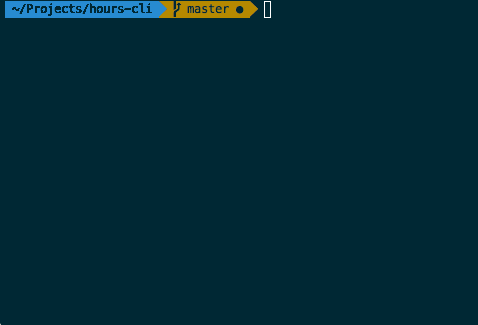

# Hours Github CLI
Pull your commits from your Github Tangent projects to submit for your hours.
The commits are are automatically taken and merged as comments.

## Screenshots

## How it works.
I usually find myself forgetting to submit my hours. My workflow for submitting hours is the following:
* Open the web interface and add entry
* Pick a project
* Choose a date
* Remember the date I just choose
* Go to Github and find the repo I was working on that day
* Copy and paste the commits in as comments
* Repeat

Tedious and error prone, so why not automate this? And that is how this project was born. It does all the above for you with minimum effort.

## How to?
* Clone project
* Run `npm install`
* Duplicate and rename `config.sample.js` to `config.js`
* Enter your credentials in `config.js`
* Edit the `from` (entries after this day) and `until` (entries before this day) fields in the format `{YYYY-MM-DD}`
* Enter your repos in the following format: `{ProjectName}:{RepoName}`
* Hours are set to a default of `9` hours. Change as you wish
* Run `npm start` to start submitting your hours

## Limitations / TODOS
* Tests of course :)
* If the program finds multiple projects worked on the same day, the hours are divided evenly. So if your defaultHours is 8 hours and you worked on two different projects, your entries will be submitted as two different entries at 4 hours each
* Submit hours through the CLI
